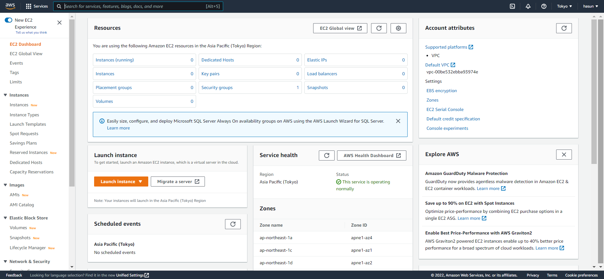

# AWS

## EC2

### 1. EC2란?

클라우드에서 확장 가능 컴퓨팅 용량을 제공하여 이를 대여하는 서비스

- 초기부터 제공되었으며 범용적인 서비스
- 독립된 컴퓨터 1대를 임대받는 것과 같음

> 우측 상단에 지역은 우리가 사용하려는 서비스가 있는 지역을 의미

### 2. Instance

컴퓨터 1대 == instance 1개

- 좌측 메뉴에서 `Instances` 클릭 => `Launch instances` 클릭

### 3. Instance Type

임대할 컴퓨터의 타입을 설정

#### AMI

- 임대할 컴퓨터의 **운영체제**를 선택

  > 나는 영상 강의와 같이 Ubuntu로 선택

#### Instance Type

- 임대할 컴퓨터의 **사양** 선택

> 나는 t2.micro로 선택

- Type : nano < micro < small < medium < large ... 으로 점점 커짐
- vCPUs : 가상의 CPU 개수
- Memory : 제공되는 메모리 용량

- Network performance : 컴퓨터가 데이터를 전송하는데 발휘되는 성능

### 4. 가격정책

인스턴스는 비용과 관련있기 때문에  잘알아보고 선택해야함

- 구글에 `AWS EC2 price` 검색

> 1년간 매달 750시간의 Linux 및 Windows t2.micro 인스턴스(t2.micro가 제공되지 않는 리전의 경우 t3.micro) 사용 시간이 포함

### 5. 장치 설정

#### Configure storage

- GiB : 사용할 용량
- Root volume : 저장 장치가 어떤 형식인지 지정

#### Advanced details

- Shutdown behavior : 컴퓨터의 운영체제에서 셧다운 시키면 어떻게 할지
  - **Stop**는 인스턴스를 일시정지시켜서 요금은 스토리지(저장장치) 요금만 부과됨
  - **Terminate**는 아예 삭제하기 때문에 데이터가 날라갈 수 있음

#### Summary

- Number of instance : 임대할 컴퓨터의 수

#### 6. 태그와 보안그룹

#### Name and tags

인스턴스의 역할, 관리자 등을 메모

#### Network settings

인스턴스에 접근하는 보안과 관련된 항목

- http://www.opentutorials.org/module/1514/9483 - 사전에 웹 애플리케이션 만들기(인터넷) 강의 듣기

- Firewall (security groups) : 생성할지, 기존으로 할지 선택
- Security group name, Description : 이름 설정하기 (중복되지 않게)

- Type : 우리가 만든 인스턴스에 접속하는 여러가지 방법 중 제한된 방법만 접속할 수 있도록 정책을 설정

- Source : Anywhere(어디서나 가능), My IP(내 컴퓨터에서만 가능)
  - SSH로 내 컴퓨터에서만 가능하게 설정
  - HTTP를 My IP로 해버리면 나만 볼 수 있음 (Anywhere로 설정)

### 7. 비밀번호 생성

접근에 제한을 두기 위해 비밀번호 생성하기

- 하단에 `Launch` 클릭

#### Create key pair

- Create new key pair 선택

- Key pair name : 비밀번호의 이름 설정

- key pair type : RSA 선택

- `Create key pair` 클릭 후 다운로드 파일 잘 보관하기 

  > 발급된 키는 다시 발급되지 않고, 컴퓨터에 저장되기 때문에 노출의 위험이 있음

- `Launch instance` 클릭

