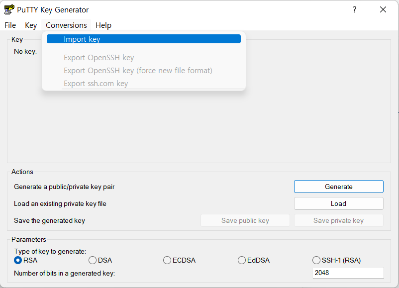
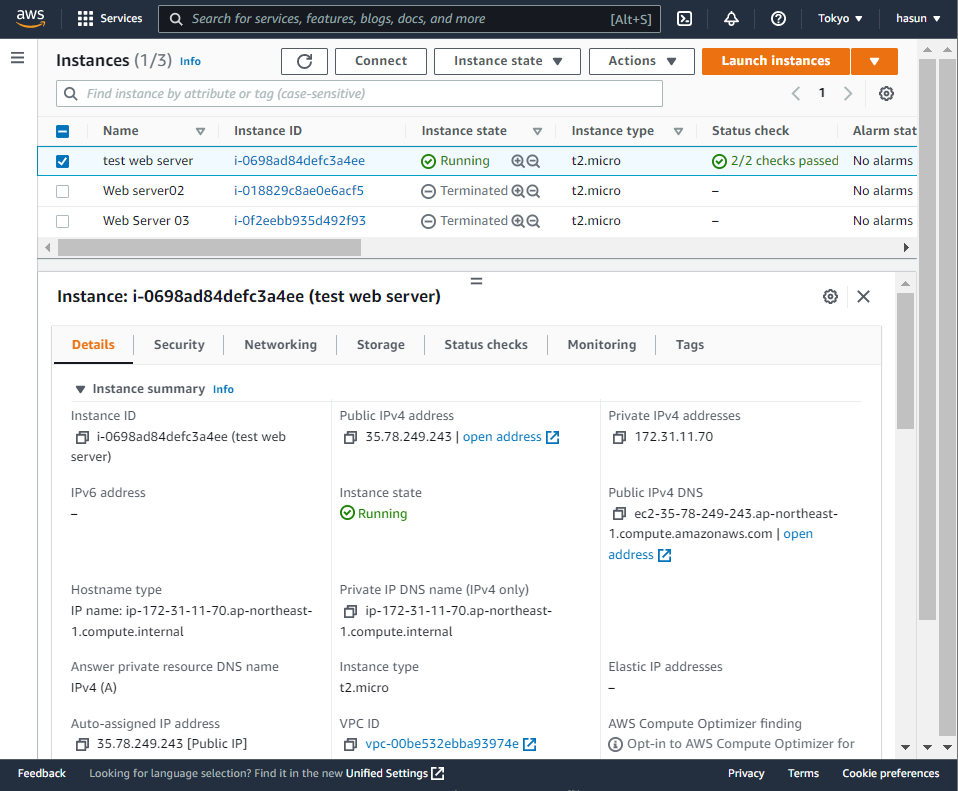

# AWS

## EC2 접속과 사용

### 1. Liunx에서  PuTTY로 접속하기

#### IP address 확인

- https://www.chiark.greenend.org.uk/~sgtatham/putty/ 링크로 들어가서 PuTTY 다운로드 받기 (무료)

 1. pem 파일을 PuTTYGEN으로 .ppk파일로 변환하여 연결할 수 있음

    

    - `Conversions` => `Import key` => 다운로드한 키 파일 선택 => `Save private key`  => "Y" => 파일 저장하기

 2. Public IP 확인하기

    - aws > instance에서 해당 인스턴스 클릭 후 Public IP를 확인

      

 3. PuTTY에서 연결하기

    - PuTTY.exe 실행하고 접속할 인스턴스의 공인 IP를 입력
    - 왼쪽 목록에서 Category => SSH => Auth => Browse 클릭 => .ppk 키 파일 선택 => Open
    - **ec2-user** 입력하면 연결 완료
