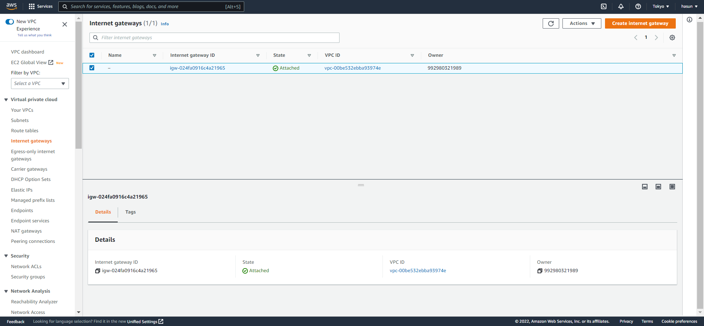

# AWS

## 가상 네트워크를 제공하는 VPC

- VPC는 기존에 1개 생성 되어 있고 용도에 따라 추가 가능

- VPC 안에는 서브넷이 존재하는데 서브넷을 여러 개로 나누어 네트워크를 격리할 수 있음(서브넷 간에 접근제어 설정 가능)
- VPC는 리전별, 서브넥은 가용영역별로 생성함

### 1. VPC 생성

> VPC를 하기 전에 공부할 네트워크 기초 지식 - https://www.youtube.com/watch?v=vCNexbgYmQ8 

- 왼쪽 목록에서 Virtual private cloud > Your VPCs => `Create VPC` 클릭

  

  > 이미 1개의 VPC가 있는 것을 확인할 수 있음 (가입과 동시에 생성됨)

  

  - Name tag : VPC 이름 설정
  - CIDR block : CIDR 표기법으로 된 IP 대역
    - 192.168.0.0/16으로 입력하는 이유는 192.168.0.0/16의 서브넷 마스크는 255.255.0.0이므로 192.168.0.0 부터 192.168.255.255 까지를 포함
  - Tenancy : VPC에서 EC2 인스턴스를 생성할 때 하드웨어의 옵션

- `Create VPC` 클릭 => VPC 생성 완료

### 2. VPC 서브넷 생성

- 왼쪽 목록에서 Virtual private cloud > Subnets => `Create Subnet` 클릭

  

  

  - VPC ID : 서브넷을 생성할 VPC 선택

  

  - Subnet name : 서브넷의 이름
  - Availability Zone : 서브넷을 생성할 가용 영역 선택
    - Asi Pacific (Tokyo) / ap-northeast-1a 로 선택함
  - IPv4 CIDR block : CIDR 표기법으로 된 IP 대역
    - 192.168.0.0/20 으로 한 이유는 192.168.0.0/20의 서브넷 마스크는 255.255.240.0이므로 192.168.0.0 부터 192.168.15.255 를 포함
    - 추가로 서브넷을 생성할 경우 기존의 서브넷과 IP 대역이 겹치지 않도록 주의

- `Create subnet` 클릭 => 서브넷 생성 완료

### 3. VPC 인터넷 게이트웨이 생성

- 왼쪽 목록에서 Virtual private cloud > Internet gateways => `Create internet gateway` 클릭

  

  

  - Name tag : 인터넷 게이트웨이의 이름

- `Create internet gateway` 클릭 => 인터넷 게이트웨이 생성 완료

- VPC에 연결하기 위해 우측 상단에 `Attach to a VPC` 클릭

  

  

  - Available VPCs : 연결할 VPC 선택

- `Attach internet gateway` 클릭 => 연결 완료 => VPC에서 생성한 인스턴스는 외부 인터넷 접속 가능

