# AWS

## Amazon Simple Storage Service (Amazon S3)

원하는 양의 데이터를 저장하고 검색할 수 있도록 구축된 객체 스토리지

### 1. S3의 장점

- 내구성 - 중요한 데이터를 저장하고 99.99999999999%의 객체 내구성을 보장하도록 설계된 내구성이 뛰어난 인프라를 제공
- 저렴한 비용 - 저렴한 비용으로 대용량의 데이터를 저장할 수 있음, 필요한 만큼만 비용 지불
- 보안 - SSL을 통한 데이터 전송과 데이터 업로드 후 자동 암호화 지원
- 확장 가능 - 원하는 만큼 데이터를 저장하고 필요할 때 액세스
- 이벤트 알림 전송 - 객체가 업도르되면 이벤트 알림을 보낼 수 있음 => 사용자가 워크플로우, 알림 또는 기타 처리 작업을 트리거할 수 있음
- 고성능 - 너트워크 처리량과 복원력을 극대화함

### 2. S3 사용

- 콘텐츠 저장 및 배포
- 빅 데이터 분석
- 클라우드 네이티브 애플리케이션 데이터
- 재해 복구

### 3. S3의 구성 요소

- Bucket - 하나의 프로젝트 == 하나의 버킷
- Folder - 버킷 안에 폴더가 존재 
- Object - 폴더 안에 존재하는 파일

### 4. Bucket 생성하기

- 콘솔에서 S3 클릭 => `Create bucket` 클릭

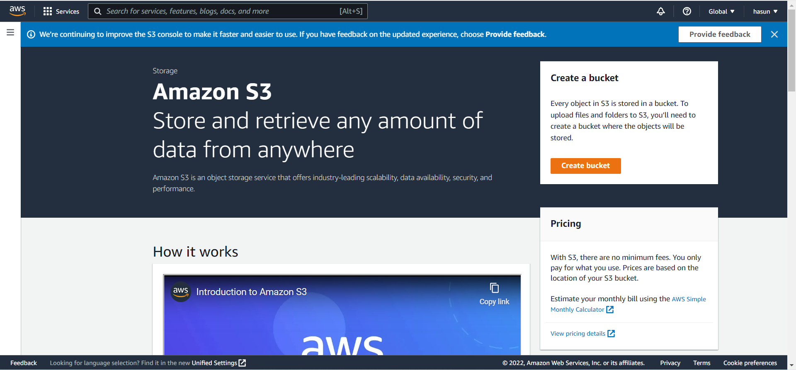

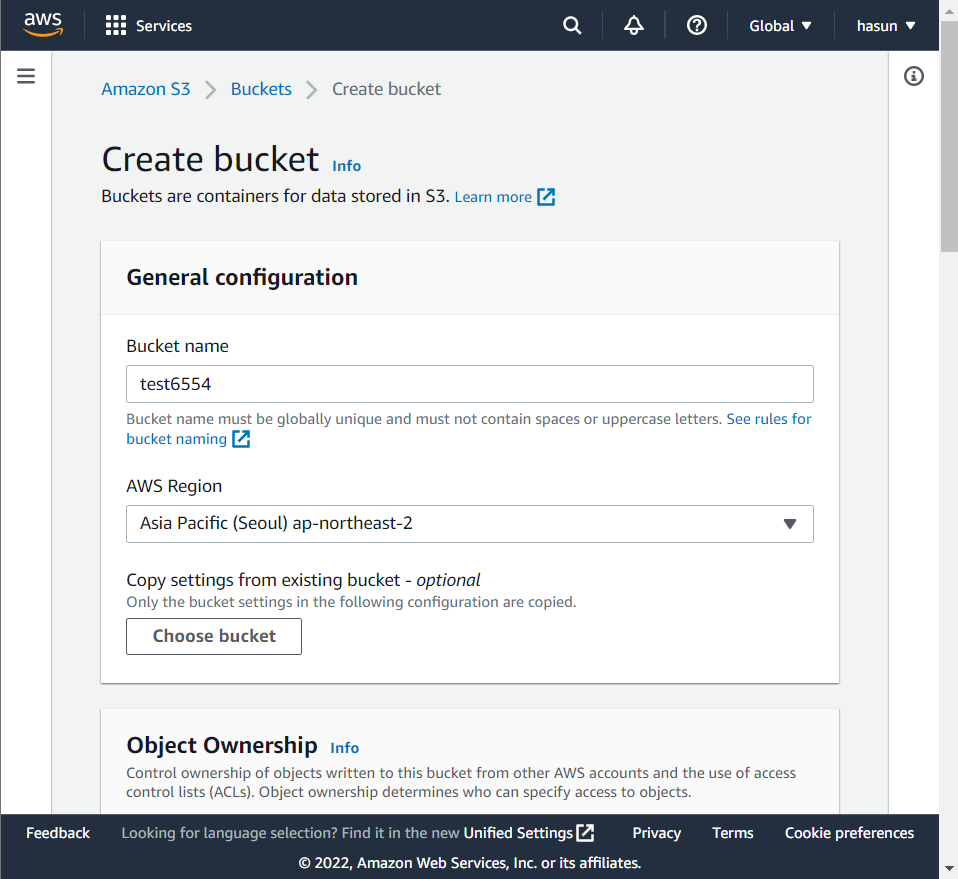

- Bucket name : 버킷 네임 설정 (전세계적으로 고유한 이름 설정)
- AWS Region : 리전 선택
- `Create bucket` 클릭

### 5. Bucket 삭제하기

- Amazon S3 > Buckets

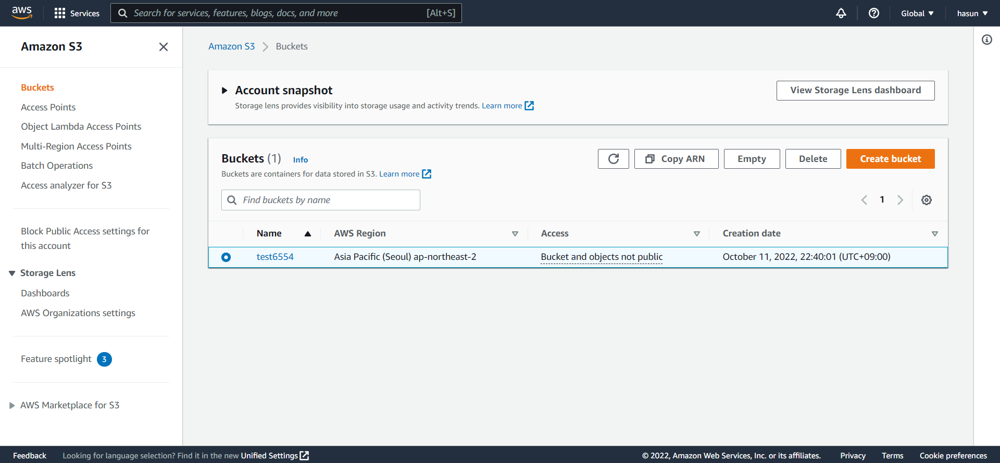

- 해당 버킷 클릭 후 `Delete` 클릭

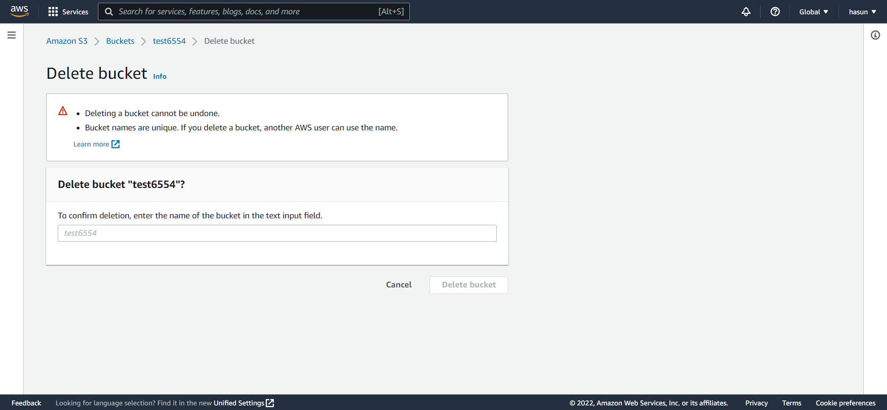

- 버킷 이름 작성 후 `Delete bucket` 클릭

  > 버킷 삭제는 취소할 수 없고, 삭제 후 다른 사용자가 이름을 사용할 수 있음

### 6. Folder 생성하기

- Amazon S3 > Buckets  > 해당 버킷 클릭 > Objects > `Create folder` 클릭

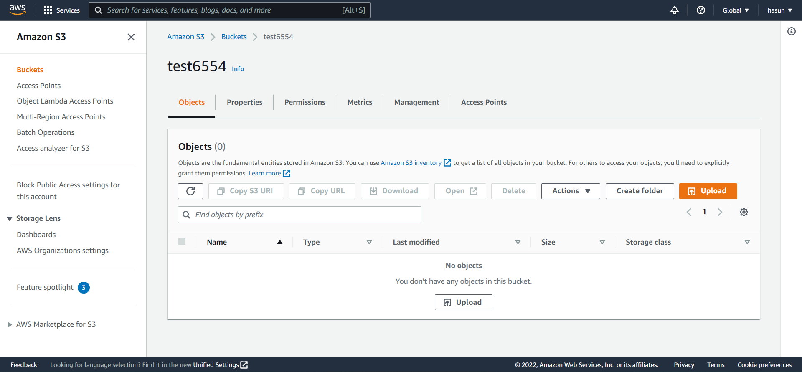

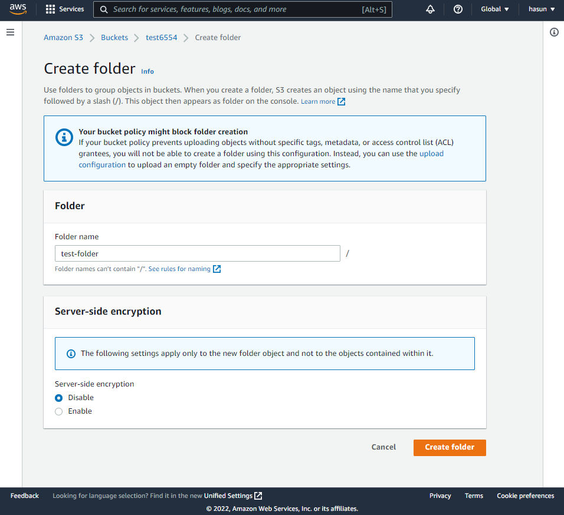

- Folder name : 폴더 이름
- `Create folder` 클릭

> 폴더의 이름 수정은 불가하기 때문에
>
> 바꿀 이름의 폴더 생성 > 기존의 폴더의 파일을 새로운 폴더에 복사 > 기존의 폴더 삭제
>
> 방법으로 수정하기

### 7. Folder 삭제하기

Amazon S3 > Buckets  > 해당 버킷 클릭 > Objects > 해당 폴더 선택 > `Delete` 클릭

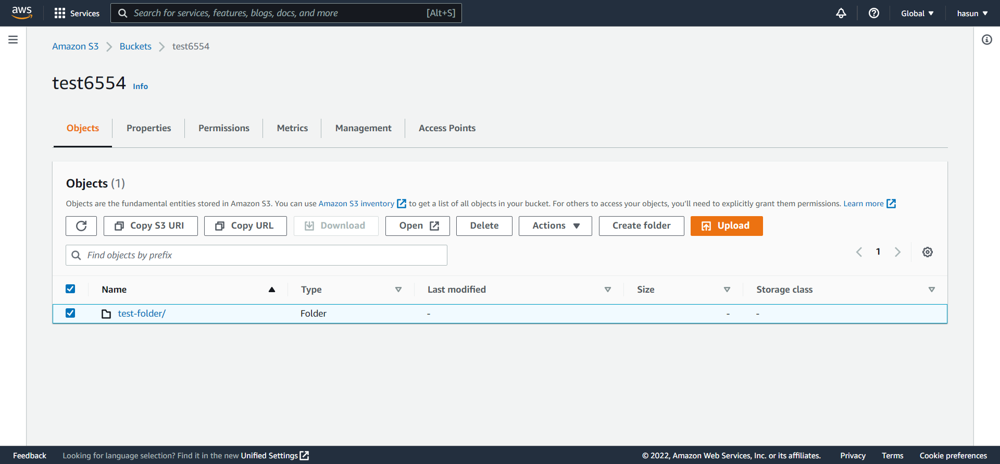

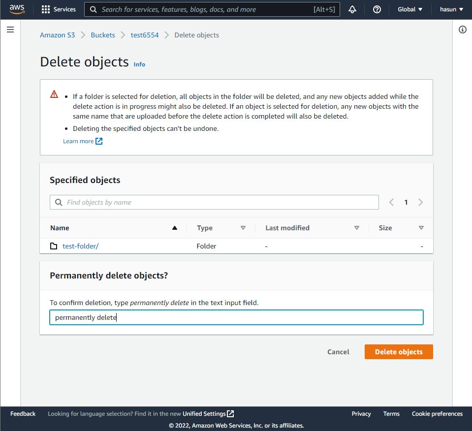

- `permanently delete` 입력 후 `Delete objects` 클릭

### 8. 업로드 하기

- 업로드하려는 파일을 드래그하면 바로 올라가짐

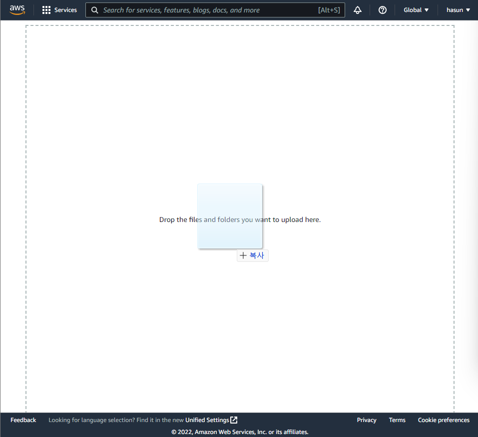

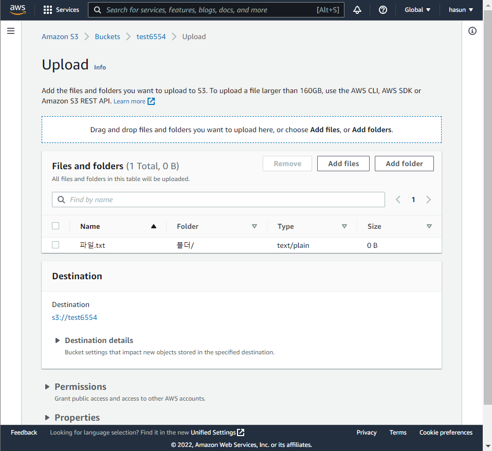

- 선택 사항 수정 후 `Upload` 클릭

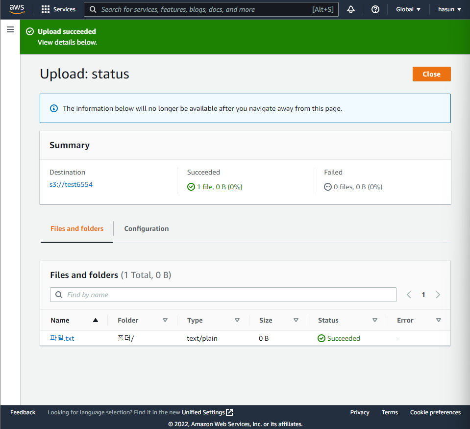

### 9. 공유와 권한

- Amazon S3 > Buckets  > 해당 버킷 클릭 > Objects > 해당 폴더 선택 > 파일 선택 > Permissions 클릭 > `Eidt ` 클릭

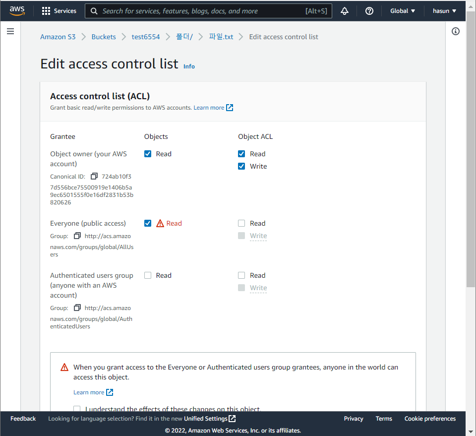

- Everyone (public access) > Read 활성화 하기

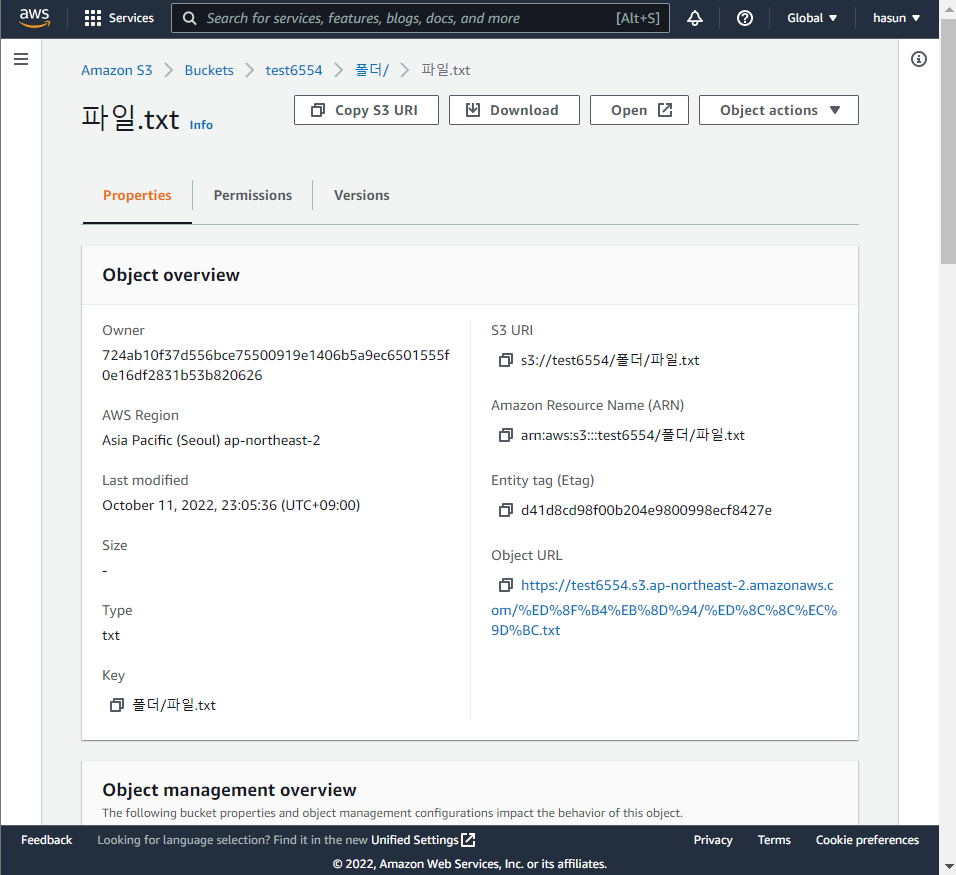

- Object URL로 접속하면 파일의 내용 읽기 가능