# AWS

## Amazon Relational Database Service (Amazon RDS)

### 1. Amazon RDS란?

가장 많이 선호하는 6가지 데이터베이스 엔진을 갖춘 관계형 데이터베이스

> Amazon Aurora, MySQL, PostgreSQL, MariaDB, Microsoft SQL Server, ORACLE 의 DB 엔진을 지원함

- 관리형 데이터베이스의 장점
  - 관리 용이성 - 하드웨어 준비, 소프트웨어 설치 등의 관리 작업 불필요
  - 가용성 및 내구성 - 다중 AZ를 통한 동기식 복제, 자동화된 백업, 스냅샷, 장애 조치
  - 뛰어난 확장성 - 몇 번의 클릭만으로도 다운타임 없이 컴퓨팅 스토리지 확장
  - 빠른 성능과 보안 - SSD 스토리지 및 성능 향상된 I/O 보장, 저장 및 전송 중 암호화 지원
- 운영 편의성 - Provision
  - AWS 콘솔에서 몇 분 만에 서비스에 필요한 데이터베이스 구성
  - 상면, 서버, 네트워크, OS 설치, DB 설치 등의 모든 작업이 불필요
- 모니터링
  - DB 인스턴스에 대한 CloudWatch 지표 모니터링
  - DB 로그를 CloudWatch Logs에 직접 upload
  - Enhanced 모니터링
  - 3rd party 모니터링 툴과 통합 가능
- 경보 (Alarm)
  - Amazon SNS와의 연계를 통해 RDS에서 이벤트 발생 시 경보 수신 가능

### 2. 가용성 및 내구성

물리적으로 분리된 가용 영역에 standby 데이터베이스를 운영하여 가용성 높임

- 읽기 전용 복제본
  - 읽기 업무를 분담하여 소스 데이터베이스에 대한 워크로드 부하 완화
  - 다른 지역의 애플리케이션에 데이터를 제공
  - 장애 발생 시 빠른 복구를 위해 읽기 전용 복제 본을 마스터로 승격

- 자동 백업 - DB 인스턴스 특정 시점 복구
  - 매일 전체 인스턴스에 대한 볼륨 백업
  - 데이터베이스 변경 로그 저장
  - 기본 7일, 최대 35일간 보관
  - 백업 중 데이터베이스 성능 영향 최소화
- 데이터베이스 스냅샷 - 데이터베이스의 인스턴스 전체를 S3에 백업
  - 증분식 백업
  - Amazon S3 99.99999999999% 내구성
  - 스냅샷 암호화 기능 지원
  - 여러 리전에 복사하거나 다른 계정과 공유 가능

### 3. DB Instance 생성하기

- 콘솔에서 Amazon RDS 클릭 > `Create database` 클릭

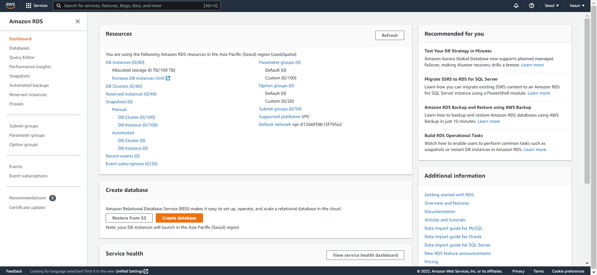

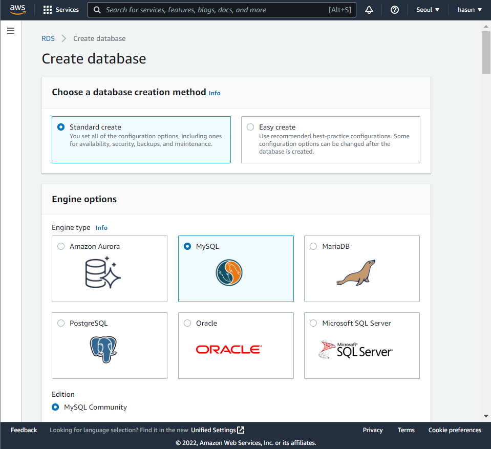

#### Engine options

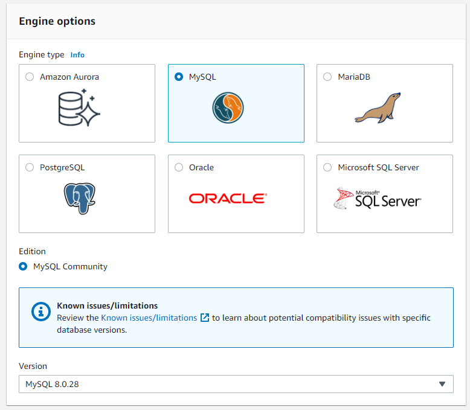

- 많이 사용하는 MySQL로 선택함
- 버전 : MySQL 8.0.28

#### Templates

- 연습용이기 때문에 Free tier 선택

#### Settings

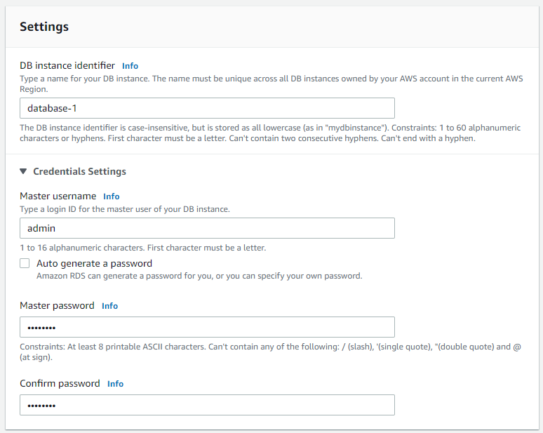

- DB instance identifier : DB 인스턴스 식별자 이름
- Master username : 마스터 사용자에 대한 로그인 ID
- Master password : 마스터 비밀번호

#### Instance configuration

- Burstable classes (includes t ckasses) 선택
- db.t2.micro 선택

#### Storage

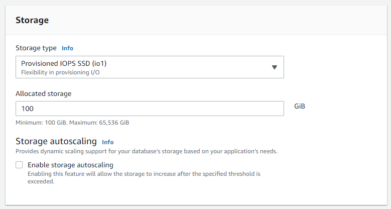

- Allocated storage : 할당된 스토리지, 연습이기 때문에 최소 GiB로 선택

#### Additional configuration

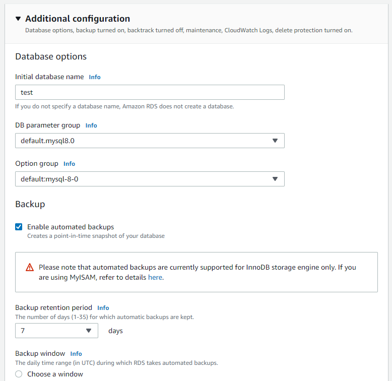

- Initial database name : 처음 생성할 데이터베이스 이름 설정
- Enable deletion protection : 삭제 방지 활성화 클릭
- `Create database` 클릭

### 4. Parameter group 생성하기

- Amazon RDS > Parameter groups 클릭 > `Create Parameter group` 클릭

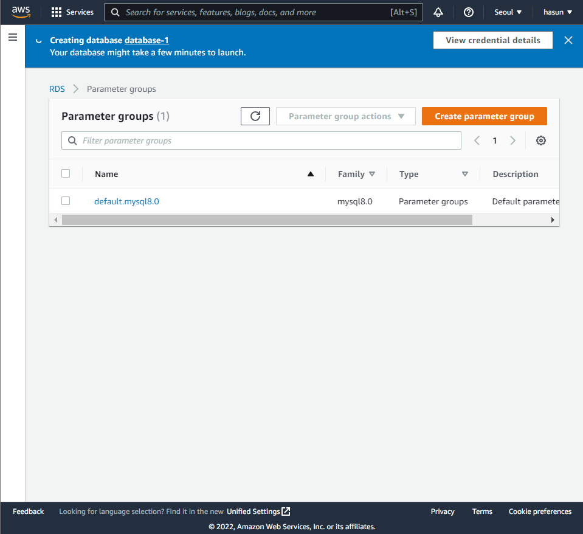

> 기존에 1개가 존재함

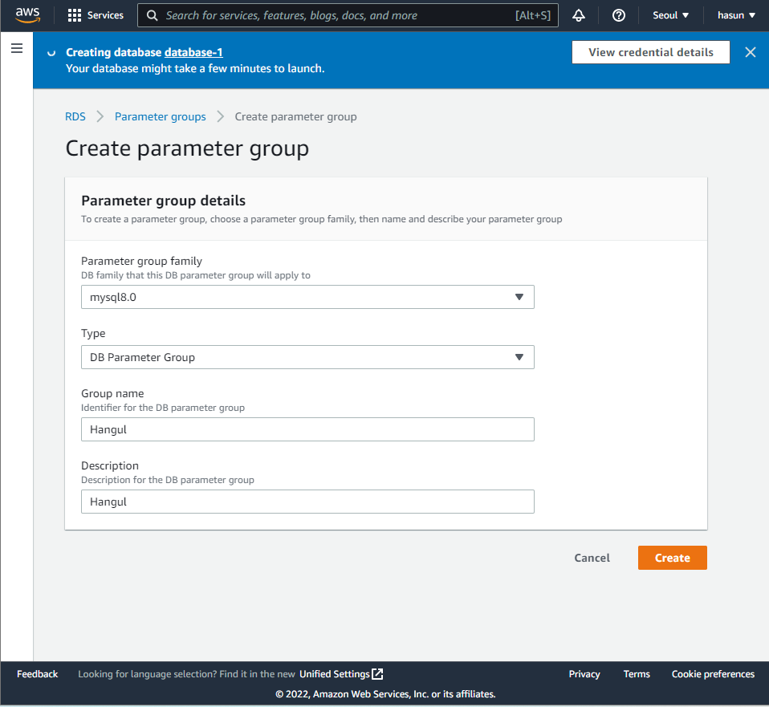

- Group name : 그룹의 이름 설정
- Description : 파라미터 그룹의 설명
- `Create` 클릭

#### 편집하기

한글처리가 된 데이터베이스를 사용하기 위해 UTF8로 변경하기

- 해당 파라미터 클릭 > `Edit parameter` 클릭 

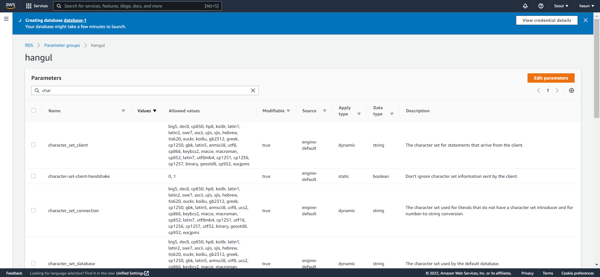

- 검색창에 `char` 입력 후 `utf8`으로 값 변경하기
- `Save changes` 클릭

- 검색창에 `collation` 입력 후 `utf8_general_ci`로 값 변경하기
- `Save changes` 클릭

### 5. Parameter 적용하기

- RDS > Databases > 해당 데이터베이스 선택 > `Modify` 클릭

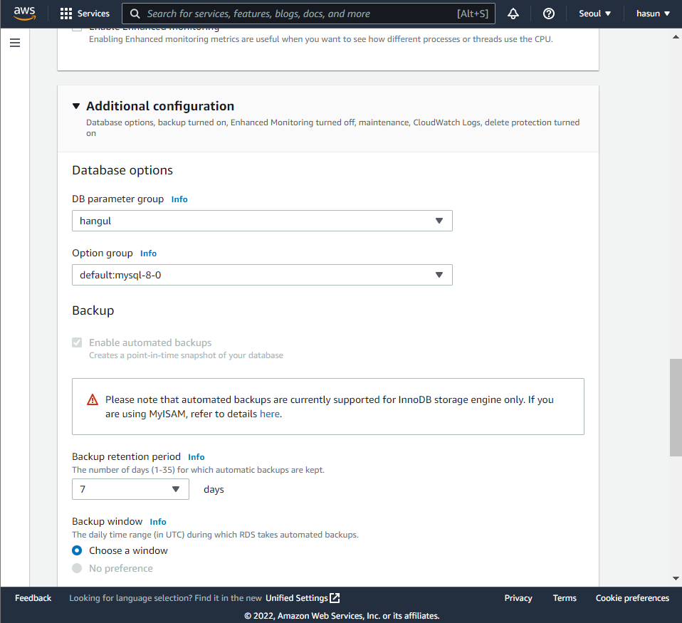

- Additional configuration에서 DB parameter group에 방금 만든 hangul 적용
- `Continue` 클릭
- `Modify DB instance` 클릭

### 6. MySQL Workbench로 접속하기

- MySQL Workbench 실행 > MySQL Connections 옆 `+` 아이콘 클릭

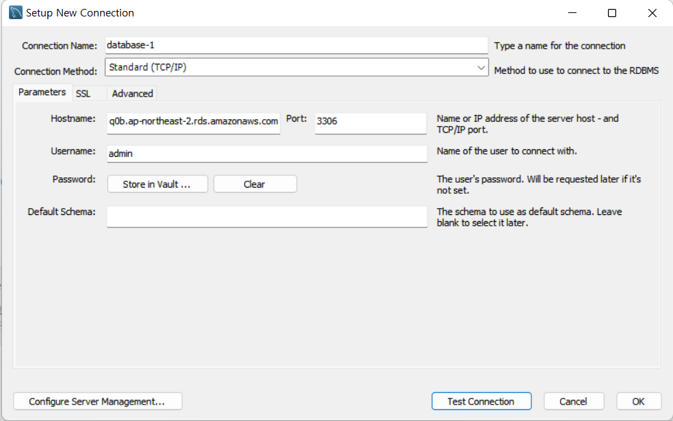

- Connection Name :  데이터베이스 이름

- Hostname : Connectivity & security > Endpoint에 있는 주소 입력

  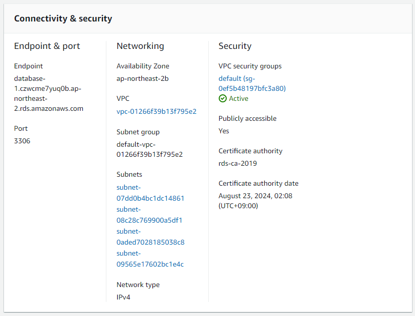

- Username : 로그인 유저 ID
- Password : `Store in Vault...` 클릭 후 비밀번호 입력
- `Test Connerction` 클릭 후 Successfully 나오면 `OK` 클릭
- 연결한 데이터베이스 클릭하면 접속 끝