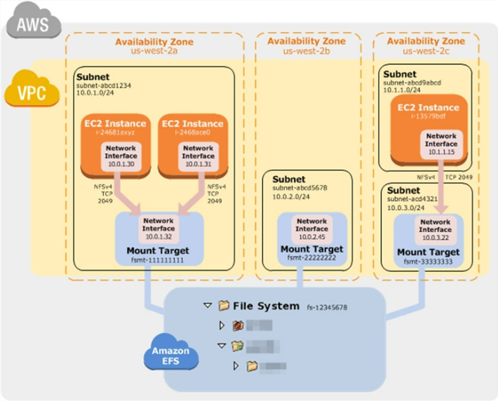

# AWS 문제 풀이

### 2022.10.18

#### #31

회사는 현재 Amazon RDS MySQL 데이터베이스가 지원하는 웹 애플리케이션을 운영하고 있습니다. 매일 실행되고 암호화되지 않은 자동 백업이 있습니다. 보안 감사에서는 향후 백업을 암호화하고 암호화되지 않은 백업을 폐기해야 합니다. 회사는 오래된 백업을 파기하기 전에 적어도 하나의 암호화된 백업을 만듭니다.
향후 백업을 위해 암호화를 활성화하려면 어떻게 해야 합니까?

- C. 데이터베이스의 스냅샷을 생성합니다. 암호화된 스냅샷에 복사합니다. 암호화된 스냅샷에서 데이터베이스를 복원합니다.

> DB 인스턴스의 스냅샷을 생성한 다음 해당 스냅샷의 암호화된 복사본을 생성할 수 있습니다. 그런 다음 암호화된 스냅샷에서 DB 인스턴스를 복원할 수 있으므로 원본 DB 인스턴스의 암호화된 복사본을 갖게 됩니다.

#### #32

회사에서 여러 Application Load Balancer 뒤에서 웹 사이트를 호스팅하고 있습니다. 회사는 전 세계적으로 콘텐츠에 대한 배포 권한이 다릅니다. 솔루션 설계자는 배포 권한을 위반하지 않고 사용자에게 올바른 콘텐츠를 제공해야 합니다.
솔루션 설계자는 이러한 요구 사항을 충족하기 위해 어떤 구성을 선택해야 합니까?

- C. 지리적 위치 정책으로 Amazon Route 53을 구성합니다.

> Amazon Route 53는 사용자 위치 기반 라우팅입니다.

#### #33

솔루션 설계자가 새 AWS 계정을 생성했으며 AWS 계정 루트 사용자 액세스를 보호해야 합니다.
이 작업을 수행할 작업 조합은 무엇입니까? (2개를 선택하세요.)

- A. 루트 사용자가 강력한 암호를 사용하는지 확인하십시오.
- B. 루트 사용자에 대한 다단계 인증을 활성화합니다.

> 강력한 암호를 사용하여 AWS Management 콘솔에 대한 계정 수준 액세스를 보호하십시오.
>
> AWS 계정 루트 사용자 계정에서 AWS MFA(다단계 인증)를 활성화합니다. 

#### #34

전자 상거래 회사의 솔루션 설계자는 애플리케이션 로그 데이터를 Amazon S3에 백업하려고 합니다. 솔루션 설계자는 로그에 얼마나 자주 액세스할지 또는 어떤 로그에 가장 많이 액세스할지 확신할 수 없습니다. 회사는 적절한 S3 스토리지 클래스를 사용하여 비용을 가능한 한 낮게 유지하려고 합니다.
이러한 요구 사항을 충족하려면 어떤 S3 스토리지 클래스를 구현해야 합니까?

- B. S3 지능형 계층화

> S3 Intelligent-Tiering은 성능 영향이나 운영 오버헤드 없이 데이터 액세스 패턴이 변경될 때 스토리지 비용을 자동으로 최적화하려는 고객을 위해 설계된 새로운 Amazon S3 스토리지 클래스입니다.

#### #35

회사의 웹사이트는 대중에게 제품을 판매하는 데 사용됩니다.
이 사이트는 ALB( Application Load Balancer) 뒤에 있는 Auto Scaling 그룹의 Amazon EC2 인스턴스에서 실행됩니다 . Amazon CloudFront 배포도 있으며 AWS WAF는 SQL 주입 공격으로부터 보호하는 데 사용됩니다. ALB는
CloudFront 배포의 오리진입니다. 최근 보안 로그를 검토한 결과 웹사이트 접근을 차단해야 하는 외부 악성 IP가 발견되었습니다.
솔루션 설계자는 애플리케이션을 보호하기 위해 무엇을 해야 합니까?

- B. AWS WAF의 구성을 수정하여 악성 IP 주소를 차단하는 IP 일치 조건을 추가합니다.

> NACL은 VPC 내에 있습니다. WAF를 사용하여 VPC에 도달하기 훨씬 전에 IP를 차단할 수 있습니다.

#### #36

솔루션 설계자는 2단계 주문 프로세스를 위한 애플리케이션을 설계하고 있습니다. 첫 번째 단계는 동기식이며 대기 시간이 거의 없이 사용자에게 반환되어야 합니다. 두 번째 단계는 시간이 오래 걸리므로 별도의 구성 요소에서 구현됩니다. 주문은 정확히 한 번 처리되어야 하며 접수된 순서대로 처리되어야 합니다.
솔루션 설계자는 이러한 구성 요소를 어떻게 통합해야 합니까?

- C. SNS 주제를 생성하고 해당 주제에 대한 Amazon SQS FIFO 대기열을 구독합니다.

> AWS에서 Amazon Simple Notification Service(SNS)는 많은 구독자에게 메시지를 전달할 수 있는 완전 관리형 게시/구독 메시징 서비스입니다. 각 구독자는 관심 있는 메시지만 수신하도록 필터 정책을 설정할 수도 있습니다.

#### #37

웹 애플리케이션은 AWS 클라우드에 배포됩니다. 웹 계층과 데이터베이스 계층을 포함하는 2계층 아키텍처로 구성됩니다. 웹 서버는 XSS(교차 사이트 스크립팅) 공격에 취약합니다.
솔루션 설계자는 취약점을 수정하기 위해 무엇을 해야 합니까?

- C. 애플리케이션 로드 밸런서를 생성합니다. 로드 밸런서 뒤에 웹 계층을 배치하고 AWS WAF를 활성화합니다.

> 공격자는 웹 애플리케이션의 취약점을 악용하기 위해 때때로 웹 요청에 스크립트를 삽입합니다.
>
> AWS WAF는 애플리케이션 가용성에 영향을 미치거나 보안을 손상시키거나 과도한 리소스를 소비할 수 있는 일반적인 웹 악용으로부터 웹 애플리케이션을 보호하는 데 도움이 되는 웹 애플리케이션 방화벽입니다.

#### #38

회사 웹 사이트에서 트랜잭션 데이터 스토리지로 Amazon RDS MySQL 다중 AZ DB 인스턴스를 사용하고 있습니다. 내부 일괄 처리를 위해 데이터를 가져오기 위해 이 DB 인스턴스를 쿼리하는 다른 내부 시스템이 있습니다. 내부 시스템이 데이터를 가져올 때 RDS DB 인스턴스 속도가 크게 느려집니다. 이는 웹 사이트의 읽기 및 쓰기 성능에 영향을 미치며 사용자는 응답 시간이 느려집니다.
어떤 솔루션이 웹사이트의 성능을 향상시킬 것입니까?

- D. RDS DB 인스턴스에 읽기 전용 복제본을 추가하고 읽기 전용 복제본을 쿼리하도록 내부 시스템을 구성합니다

> 애플리케이션에서 읽기 전용 복제본으로 읽기 쿼리를 라우팅하여 원본 DB 인스턴스의 로드를 줄일 수 있습니다.

#### #39

애플리케이션은 여러 가용 영역의 Amazon EC2 인스턴스에서 실행됩니다.
인스턴스는 Application Load Balancer 뒤의 Amazon EC2 Auto Scaling 그룹에서 실행됩니다 . 애플리케이션은 EC2 인스턴스의 CPU 사용률이 40% 또는 거의 40%일 때 가장 잘 수행됩니다.
솔루션 설계자는 그룹의 모든 인스턴스에서 원하는 성능을 유지하기 위해 무엇을 해야 합니까?

- B. 대상 추적 정책을 사용하여 Auto Scaling 그룹을 동적으로 확장합니다.

> 목표 추적 조정 정책을 사용하면 조정 지표를 선택하고 목표 값을 설정합니다. Amazon EC2 AutoScaling은 조정 정책을 트리거하는 CloudWatch 경보를 생성 및 관리하고 지표 및 대상 값을 기반으로 조정 조정을 계산합니다.

#### #40

회사에서 내부 브라우저 기반 응용 프로그램을 실행합니다. 애플리케이션은 Application Load Balancer 뒤의 Amazon EC2 인스턴스에서 실행됩니다. 인스턴스는 여러 가용 영역에 걸쳐 Amazon EC2 Auto Scaling 그룹에서 실행됩니다. Auto Scaling 그룹은 근무 시간 동안 최대 20개의 인스턴스를 확장하지만
야간에는 2개의 인스턴스로 축소합니다. 직원들은 하루가 시작될 때 응용 프로그램이 매우 느리다고 불평하고 있습니다.
직원 불만을 해결하고 비용을 최소화하려면 규모를 어떻게 변경해야 합니까?

- C. 낮은 CPU 임계값에서 트리거된 대상 추적 작업을 구현하고 휴지 기간을 줄입니다.

> Auto Scaling이 수요 증가에 충분히 빠르게 응답하지 않는다는 것입니다. 그렇기 때문에 휴지 기간을 줄이면 Auto Scaling이 더 공격적이고 반응적이지만 처음부터 20개 미만의 인스턴스를 실행하므로 비용이 적게 듭니다. 또한 AWS는 가능한 한 target scaling을 사용할 것을 권장합니다.

#### #41

금융 서비스 회사에 미국과 유럽의 사용자에게 서비스를 제공하는 웹 응용 프로그램이 있습니다. 애플리케이션은 데이터베이스 계층과 웹 서버 계층으로 구성됩니다. 데이터베이스 계층은 us-east-1에서 호스팅되는 MySQL 데이터베이스로 구성됩니다. Amazon Route 53 지리 근접 라우팅은 가장 가까운 리전의 인스턴스로 트래픽을 전달하는 데 사용됩니다. 시스템의 성능 검토에 따르면 유럽 사용자는 미국 사용자와 동일한 수준의 쿼리 성능을 받지 못하고 있습니다.
성능을 향상시키려면 데이터베이스 계층에 어떤 변경 사항을 적용해야 합니까?

- D. 데이터베이스를 MySQL 호환 모드에서 Amazon Aurora 글로벌 데이터베이스로 마이그레이션합니다. 유럽 리전 중 하나에서 읽기 전용 복제본을 구성합니다.

>읽기 전용 복제본을 사용하여 성능을 쉽게 해결할 수 있다는 것입니다.

#### #42

회사는 온프레미스에서 정적 웹 사이트를 호스팅하고 웹 사이트를 AWS로 마이그레이션하려고 합니다. 웹사이트는 전 세계 사용자에게 가능한 한 빨리 로드되어야 합니다. 회사는 또한 가장 비용 효율적인 솔루션을 원합니다.
솔루션 설계자는 이를 달성하기 위해 무엇을 해야 합니까?

- B. 웹 사이트 콘텐츠를 Amazon S3 버킷에 복사합니다. 정적 웹 페이지 콘텐츠를 제공하도록 버킷을 구성합니다. S3 버킷을 오리진으로 사용하여 Amazon CloudFront를 구성합니다.

>CloudFront는 엣지 로케이션이라고 하는 전 세계 데이터 센터 네트워크를 통해 콘텐츠를 제공합니다. 사용자가 CloudFront에서 제공하는 콘텐츠를 요청하면 가장 짧은 지연 시간(시간 지연)을 제공하는 엣지 로케이션으로 사용자가 라우팅되므로 콘텐츠가 가능한 최고의 성능으로 제공됩니다.

#### #43

솔루션 설계자는 Amazon Linux를 기반으로 하는 고성능 컴퓨팅(HPC) 환경을 위한 스토리지를 설계하고 있습니다. 워크로드는 공유 스토리지와 대용량 컴퓨팅이 필요한 많은 양의 엔지니어링 도면을 저장하고 처리합니다.
어떤 스토리지 옵션이 최적의 솔루션이 될까요?

- B. Lustre용 Amazon FSx

>Amazon FSx for Lustre는 Lustre 파일 시스템을 기반으로 AWS에서 제공하는 새로운 완전관리형 서비스입니다. Amazon FSx for Lustre는 기계 학습, 고성능 컴퓨팅(HPC), 비디오 처리, 재무 모델링, 전자 설계 자동화(EDA)와 같은 워크로드의 빠른 처리에 최적화된 고성능 파일 시스템을 제공합니다.
>
>HPC + Linux = Lustre용 FSx

#### #44

회사는 AWS에 배포된 기존 워크로드에 대한 AWS Well-Architected Framework 검토를 수행하고 있습니다. 검토 결과 다른 AWS 서비스를 지원하기 위해 최근에 설치된 Microsoft Active Directory 도메인 컨트롤러와 동일한 Amazon EC2 인스턴스에서 실행되는 공개 웹 사이트가 확인되었습니다. 솔루션 설계자는 아키텍처의 보안을 개선하고 IT 직원의 관리 요구를 최소화할 수 있는 새로운 설계를 권장해야 합니다.
솔루션 설계자는 무엇을 권장해야 합니까?

- A. AWS Directory Service를 사용하여 관리형 Active Directory를 생성합니다. 현재 EC2 인스턴스에서 Active Directory를 제거합니다.

>AWS Directory Service를 사용하면 Microsoft Active Directory(AD)를 관리형 서비스로 실행할 수 있습니다.

#### #45

회사는 Amazon S3 버킷 내에서 정적 웹 사이트를 호스팅합니다. 솔루션 설계자는 실수로 삭제된 경우 데이터를 복구할 수 있는지 확인해야 합니다.
어떤 조치가 이를 달성할 것입니까?

- A. Amazon S3 버전 관리를 활성화합니다.

>버전 관리가 활성화되면 데이터를 복구할 수 있으며 파일 삭제, MFA 삭제와 같은 추가 보호 기능도 제공합니다. MFA 삭제는 AWS Management 콘솔 이 아닌 CLI 또는 API 상호 작용에 대해서만 작동합니다 . 또한 IAM 사용자 자격 증명을 사용하여 MFA로 버전 DELETE 작업을 수행할 수 없습니다. 루트 AWS 계정을 사용해야 합니다.

#### #46

회사의 프로덕션 애플리케이션은 Amazon RDS MySQL DB 인스턴스에서 OLTP(온라인 트랜잭션 처리) 트랜잭션을 실행합니다. 회사는 동일한 데이터에 액세스할 수 있는 새로운 보고 도구를 출시하고 있습니다. 보고 도구는 가용성이 높아야 하며 프로덕션 애플리케이션의 성능에 영향을 미치지 않아야 합니다.
어떻게 달성할 수 있습니까?

- B. 프로덕션 RDS DB 인스턴스의 다중 AZ RDS 읽기 전용 복제본을 생성합니다.

>이제 Amazon RDS 읽기 전용 복제본이 다중 AZ 배포를 지원 합니다.
>Amazon RDS 읽기 전용 복제본을 사용하면 동일한 AWS 리전 또는 다른 AWS 리전에서 데이터베이스 인스턴스의 읽기 전용 복사본을 하나 이상 생성할 수 있습니다

#### #47

회사는 가상화된 컴퓨팅 리소스가 없는 작은 데이터 클로짓 내의 지점 사무실에서 애플리케이션을 실행합니다. 애플리케이션 데이터는 NFS 볼륨에 저장됩니다. 규정 준수 표준에 따라 NFS 볼륨의 매일 오프사이트 백업이 필요합니다.
어떤 솔루션이 이러한 요구 사항을 충족합니까?

- B. AWS Storage Gateway 파일 게이트웨이 하드웨어 어플라이언스를 온프레미스에 설치하여 Amazon S3에 데이터를 복제합니다.

>AWS Storage Gateway 하드웨어 어플라이언스 - 기존 VMware ESXi, Microsoft Hyper-V 및 Amazon EC2 지원에 추가하여 Storage Gateway를 하드웨어 어플라이언스로 사용할 수 있습니다. 즉, 가상화된 환경, 서버급 하드웨어 또는 관리에 필요한 전문 기술을 갖춘 IT 직원이 없는 상황에서도 Storage Gateway를 사용할 수 있습니다.

#### #48

회사의 웹 애플리케이션은 여러 Linux Amazon EC2 인스턴스를 사용하고 Amazon Elastic Block Store(Amazon EBS) 볼륨에 데이터를 저장하고 있습니다. 이 회사는 장애 발생 시 애플리케이션의 탄력성을 높이고 원자성, 일관성, 격리 및 내구성(ACID)을 준수하는 스토리지를 제공하는 솔루션을 찾고 있습니다.
솔루션 설계자는 이러한 요구 사항을 충족하기 위해 무엇을 해야 합니까?

- C. 여러 가용 영역에 걸쳐 Auto Scaling 그룹이 있는 Application Load Balancer를 생성합니다. Amazon Elastic File System(Amazon EFS)에 데이터를 저장하고 각 인스턴스에 대상을 탑재합니다.

>아래의 그림에서 VPC에는 3개의 가용 영역이 있으며 각 가용 영역에는 하나의 탑재 대상이 생성됩니다. 동일한 가용 영역 내의 탑재 대상에서 파일 시스템에 액세스하는 것이 좋습니다. 가용 영역 중 하나에는 두 개의 서브넷이 있습니다. 그러나 탑재 대상은 서브넷 중 하나만 생성됩니다.
>
>

#### #49

팀의 모든 AWS 계정에서 특정 서비스 또는 작업에 대한 액세스를 제한하는 보안 팀. 모든 계정은 AWS Organizations의 대규모 조직에 속합니다.
솔루션은 확장 가능해야 하며 권한을 유지할 수 있는 단일 지점이 있어야 합니다.
솔루션 설계자는 이를 달성하기 위해 무엇을 해야 합니까?

- D. 루트 조직 단위에서 서비스 제어 정책을 만들어 서비스 또는 작업에 대한 액세스를 거부합니다.

>서비스 제어 정책 개념 - SCP는 계정의 모든 IAM 엔터티에 대한 중앙 액세스 제어를 제공합니다. 이를 사용하여 비즈니스의 모든 사람이 따르도록 하려는 권한을 적용할 수 있습니다. SCP를 사용하면 개발자가 정의한 경계 내에서만 작동할 수 있다는 것을 알기 때문에 개발자가 자신의 권한을 더 자유롭게 관리할 수 있습니다.

#### #50

데이터 과학 팀은 야간 로그 처리를 위한 스토리지가 필요합니다. 로그의 크기와 수는 알 수 없으며 24시간 동안만 유지됩니다.
가장 비용 효율적인 솔루션은 무엇입니까?

- B. Amazon S3 Standard

>S3 Standard는 자주 액세스하는 데이터에 대해 높은 내구성, 가용성 및 성능 개체 스토리지를 제공합니다. 짧은 대기 시간과 높은 처리량을 제공하기 때문에 S3 Standard는 클라우드 애플리케이션, 동적 웹 사이트, 콘텐츠 배포, 모바일 및 게임 애플리케이션, 빅 데이터 분석을 비롯한 다양한 사용 사례에 적합합니다.

